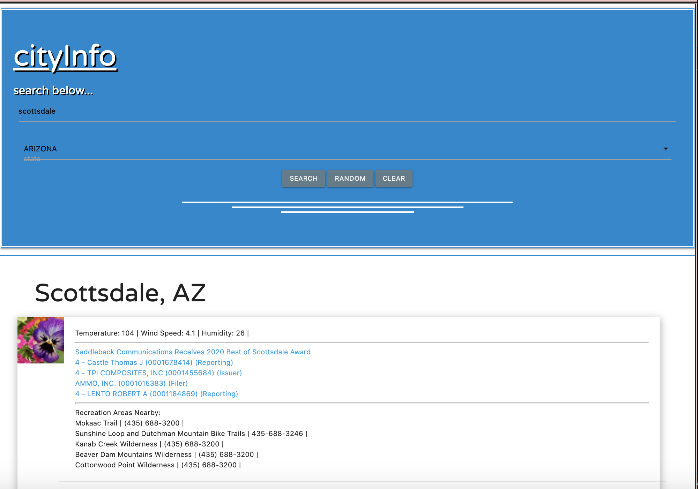

# Title:
> p1_location_info 
## Description: 
> Enter a city, and state within the United States. Click the search button. The results will include the current weather, current news, and recreation areas nearby. The news search includes links that take you to that particular news website. 
> deployed URL: https://jmuncrief.github.io/p1_location_info/
> ;
# Table of Contents:
- [Title](#Title)
- [Description](#Description)
- [Table Of Contents](#TableOfContents)
- [Prerequisites](#Prerequisites)
- [Tests](#Tests)
- [Contributing](#Contributing)
- [Usage](#Usage) 
- [License](#License)
- [Further Contact](#FurtherContact)
## Prerequisites:
> All you need to run this application is an internet connection and the browser of your choice.  
## Tests:
> None
## Contributing:
> Jordan Muncrief, Rachel Sackles, Steven Jones, Matthew Fitzpatrick.
## Usage:
>  Enter a city, and state within the United States. Click the search button. The results will include the current weather, current news, and recreation areas nearby. The news search includes links that take you to that particular news website.  
## License
> © 2020 Steven Jones. All Rights Reserved
## Further Contact:
> Feel free to reach out to me with questions involving this project on GITHUB at : [stevensjones](https://github.com/stevensjones);
